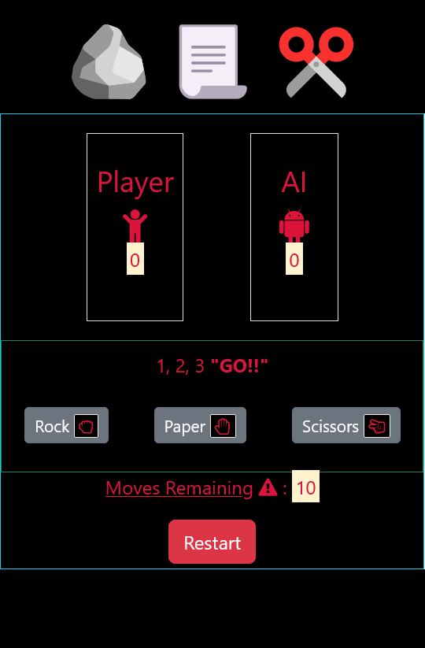

# 
 🏷️**rock-paper-scissors** 

## 
  

---

## 
 _Description_ 📝

just for the fun of it...

## 
 _Technologies Used_ 💬

Html, CSS, Javascript, Bootstrap

---

## _Table of Contents📖_

- [Installation](#Installation)💾
- [Usage](#Usage)🖥️
- [Links](#Links)📎
- [Credits](#Credits)💳
- [Licence](#License)🪪
- [Badges](#Badges)🦡
- [Questions](#Questions)❓
- [Contribution](#Contribution)➕
- [Tests](#Tests)🧪

---

## _Installation💾_

---

## _Usage🖥️_

## _Links📎_

Click for Github repo and deployed Links

- [rock-paper-scissors](https://github.com/A-N26/rock-paper-scissors)

- <N/A>

## _Credits💳_

google/youtube

## _License🪪🦡_

(**Please Click the BADGE for the license details.**)

## _Badges🦡_

   

## _Questions❓_

If you would like to as me anything (ama) about the project, please contact me on the info mentioned below:

Contact Me✉️

- My GitHub Profile - [A-N26](https://github.com/A-N26)

- e-mail - [📧](A-N26@github.com)

## _Contribution➕_

Please do not hesitate to fork this repo. And, there-after, create a new branch and commit, push that branch and create a pull request.☻

## _Tests🧪_

N/A
